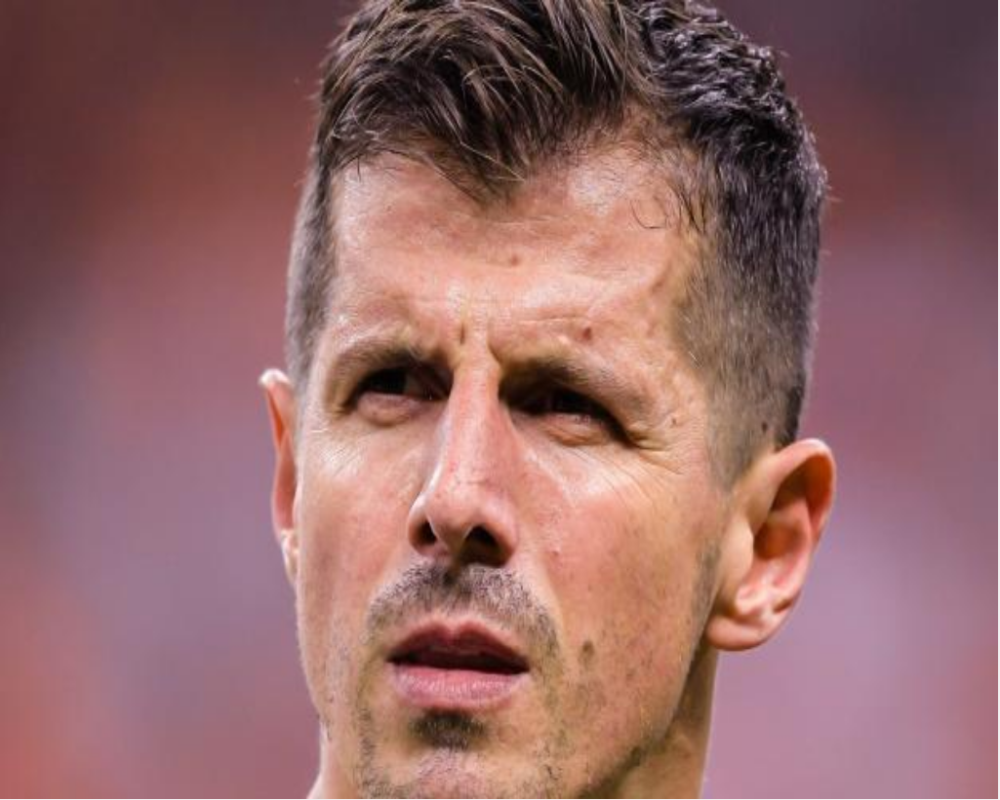
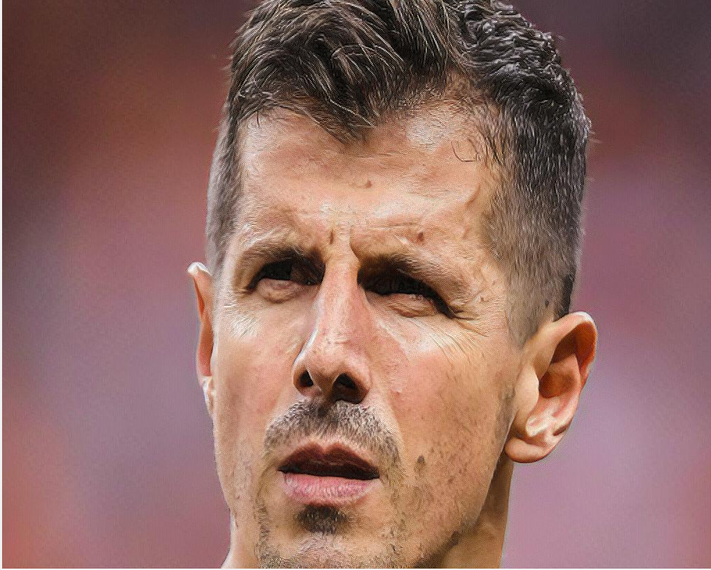
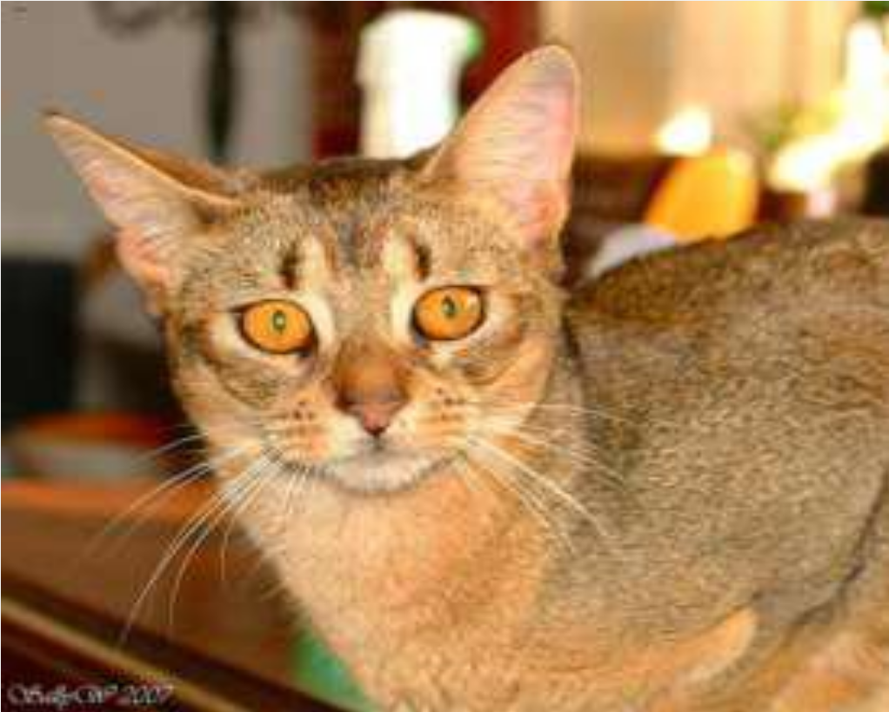
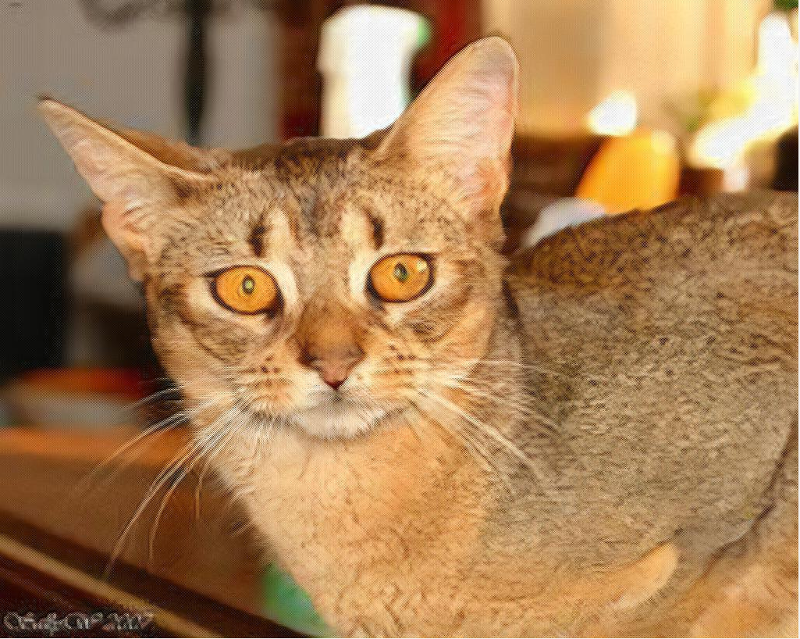

# Increasing Image Resolution

## Overview 

- Presenting a web application that leverage deep learning to increase the resolution of images.
- The deep learning model is an Unet trained over this [dataset](https://www.robots.ox.ac.uk/~vgg/data/pets/) of dogs and cats.
- The implementation method of the deep learning model is described in this [notebook](https://github.com/fastai/course-v3/blob/master/nbs/dl1/lesson7-superres.ipynb) of [FASTAI](https://www.fast.ai/).
- The web structure is build using this [repository](https://github.com/feiwu77777/fastai-v3) of anurag
- The HTML templates are taken from this [work](https://github.com/anagar20/Resnet-Image-Classification-Flask-App) of anagar20

## Demonstration
- The application deployed at [https://image-enhance-yqa7.onrender.com](https://image-enhance-yqa7.onrender.com)
- Before

- After

- Before

- After

## Local usage

- you can use this application locally on your computer.
- download or clone this repository.
- cd to its location.
- run "pip install -r requirements". 
- then "python app/server.py serve" to launch the application.
